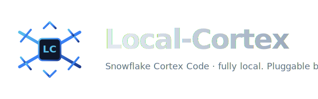
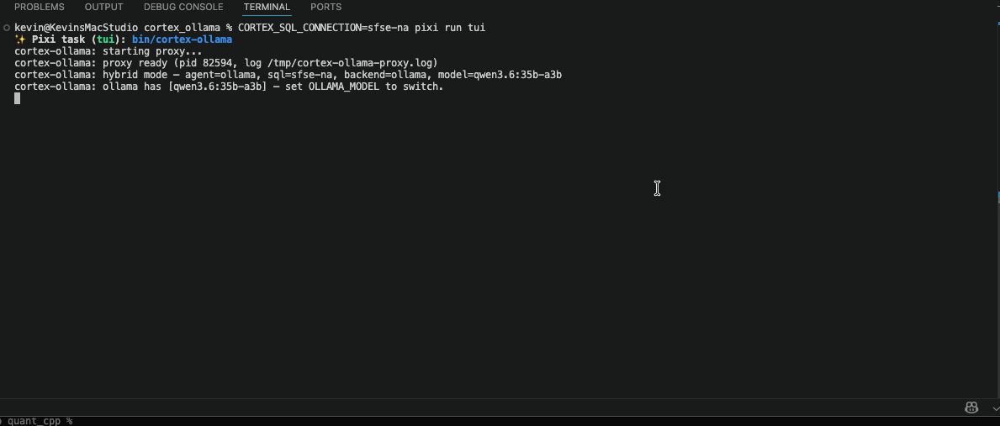
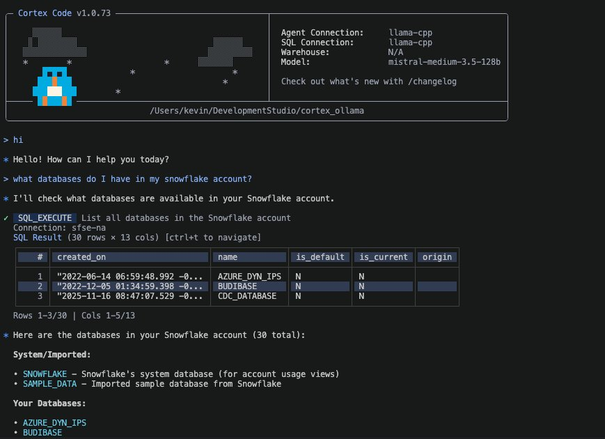
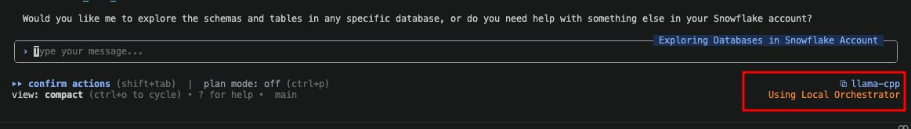

<p align="center">
  
</p>

<h1 align="center">Local-Cortex</h1>
<p align="center">
  <em>Snowflake Cortex Code CLI, driven by a local LLM. Real Snowflake for SQL.</em>
</p>

<p align="center">
  
</p>

<p align="center">
  
  
</p>

> **Heads-up.** This is a spare-time proof-of-tech for educational and
> *art-of-the-possible* purposes. **Not** intended for production use, and
> **not** supported, sponsored, or endorsed by Snowflake.

**Local-Cortex** routes Cortex Code's inference traffic at the LLM of your
choice and leaves the rest of the TUI — tool calling, slash commands,
planning, MCP — intact. SQL execution (`sql_execute`) keeps running against a
real Snowflake account via Cortex's native split-connection support, so you
get local-AI economics with real-Snowflake data access.

Designed to work with **Ollama**, the **OpenAI API** (and any
OpenAI-compatible vendor — xAI / Groq / OpenRouter / llama.cpp / LMStudio /
vLLM), and the **Anthropic API**.

> Tested live with **Ollama** (`/api/chat`) and **llama.cpp**
> (`llama-server` via `/v1/chat/completions`). The dedicated OpenAI and
> Anthropic adapters are implemented but **not yet exercised against the
> live vendor APIs** — treat them as alpha until someone reports back.

## Quick start (pixi)

Prereqs on `$PATH`: [**Cortex Code CLI**](https://docs.snowflake.com/en/user-guide/cortex-code/cortex-code-cli),
**Ollama** (with at least one model pulled), and **openssl**. Plus a Snowflake
account with a PAT — that's where `sql_execute` will run queries.

```bash
git clone https://github.com/KellerKev/Local-Cortex.git
cd Local-Cortex
pixi install
pixi run gen-cert
cp configs/ollama-hybrid.toml cortex_ollama.toml
```

Open `cortex_ollama.toml` and set:

```toml
[backends.ollama]
base_url = "http://127.0.0.1:11434"
model    = "qwen3.6:35b-a3b"      # any model from `ollama list`

[snowflake]
agent_connection = "ollama"
sql_connection   = "sf-real"      # connection name you'll add to ~/.snowflake/config.toml below
```

Then append two connection blocks to `~/.snowflake/config.toml`:

```toml
[connections.ollama]              # proxy stub — browser-free auth for cortex
account       = "ollamaproxy"
host          = "localhost"
port          = 2443
user          = "ollama"
password      = "dummy-pat-token"
authenticator = "PROGRAMMATIC_ACCESS_TOKEN"
role          = "PUBLIC"

[connections.sf-real]             # your real Snowflake — name matches sql_connection
account   = "YOUR_ACCOUNT_LOCATOR"
user      = "your-username"
password  = "<paste your PAT here>"
role      = "ACCOUNTADMIN"        # or whatever the PAT permits
warehouse = "COMPUTE_WH"
```

> Leave the `authenticator` field **off** the real-account block. Some
> Snowflake accounts reject PATs when the authenticator is set explicitly
> but accept the same token as a regular password (auto-detected). The
> proxy stub above keeps the explicit authenticator because our HTTPS stub
> relies on the PAT code path to skip browser auth.

Run it:

```bash
pixi run tui
```

Cortex Code's TUI boots, agent traffic streams through your local Ollama,
and any `sql_execute` call routes to `sf-real`.

## Quick start (no pixi)

Same as above, just swap the pixi steps for a plain venv:

```bash
git clone https://github.com/KellerKev/Local-Cortex.git
cd Local-Cortex

python3 -m venv .venv && source .venv/bin/activate
pip install fastapi uvicorn httpx pydantic

# self-signed cert for the HTTPS listener
mkdir -p certs && openssl req -x509 -newkey rsa:2048 -nodes -days 3650 \
  -keyout certs/localhost.key -out certs/localhost.crt \
  -subj '/CN=localhost' -addext 'subjectAltName=DNS:localhost,IP:127.0.0.1'

cp configs/ollama-hybrid.toml cortex_ollama.toml
# … edit it, and the two ~/.snowflake/config.toml blocks above …
```

Then in one shell:

```bash
python -m proxy
```

…and in another:

```bash
export CORTEX_AGENT_USE_LOCAL_ORCHESTRATOR=1
export NODE_TLS_REJECT_UNAUTHORIZED=0
export CORTEX_SQL_CONNECTION=sf-real
cortex -c ollama --no-auto-update
```

## Choosing a local model

Edit `cortex_ollama.toml`:

```toml
[backends.ollama]
model = "qwen3-coder:30b"
```

Or one-shot via env var:

```bash
OLLAMA_MODEL=devstral-small-2:latest pixi run tui
```

Or hot-swap mid-session without restarting cortex:

```bash
# inside another shell
curl -X POST http://127.0.0.1:2031/model \
     -H 'Content-Type: application/json' \
     -d '{"model": "qwen3-coder:30b"}'
```

The proxy validates the name against `ollama list` and 400s on typos.
Inside the TUI, the bundled `/local-models` slash command prints the same
recipe so you don't have to leave the session.

What's installed locally:
```bash
pixi run cortex -- --list-models
```

## Choosing a backend

Edit `cortex_ollama.toml`:

```toml
backend = "ollama"   # or "openai", "anthropic"
```

The `configs/` directory has self-contained samples — `ollama-hybrid.toml`
is the recommended starting point; others cover OpenAI-compat endpoints
(`openai.toml`, `openai-via-ollama.toml`, `llama-server.toml`) and the
Anthropic Messages API (`anthropic.toml`, `anthropic-via-litellm.toml`).

Hot-swap a backend without restarting:

```bash
curl -X POST http://127.0.0.1:2031/backend \
     -H 'Content-Type: application/json' \
     -d '{"backend": "openai"}'
```

## Hybrid mode — how the SQL routing works

Cortex internally separates its **agent connection** (inference) from its
**SQL connection** (database queries). When `sql_connection` is set in
`cortex_ollama.toml`, the wrapper plumbs that name into Cortex's native
`sqlConnectionName` so SQL-family tools (`sql_execute`, `snowflake_object_search`,
`snowflake_product_docs`, `semantic_view_search`) target the real account.

On top of that, the proxy runs a **safety net**: every Snowflake-family
`tool_use` that the model emits without a `connection:` field — or with a
`connection:` that names the agent connection by mistake — is rewritten to
your real connection before it's forwarded to Cortex. Guards against model
drift on long sessions.

## REST surface

```
GET  /healthz   backend, base_url, model, timestamp
GET  /model     current model + configured default
POST /model     { "model": "..." }                            hot-swap model
GET  /models    available model list (per backend)
GET  /backend   current backend + configured ones
POST /backend   { "backend": "...", "model": "..." (opt) }    hot-swap backend
```

## Env vars honored by the proxy

| var                       | default                   | meaning                                                   |
|---------------------------|---------------------------|-----------------------------------------------------------|
| `OLLAMA_BASE_URL`         | `http://127.0.0.1:11434`  | Ollama server                                             |
| `OLLAMA_MODEL`            | `qwen3.6:35b-a3b`         | model passed to Ollama                                    |
| `OPENAI_API_KEY`          | unset                     | api key for the openai backend                            |
| `ANTHROPIC_API_KEY`       | unset                     | api key for the anthropic backend                         |
| `CORTEX_AGENT_CONNECTION` | `ollama`                  | connection used for the agent loop (on the proxy)         |
| `CORTEX_SQL_CONNECTION`   | unset                     | connection used for SQL tools (set to your real account)  |
| `CORTEX_PROXY_HTTP_PORT`  | `2031`                    | plaintext listener (agent:run) port                       |
| `CORTEX_PROXY_HTTPS_PORT` | `2443`                    | TLS listener (Snowflake auth) port                        |
| `CORTEX_OLLAMA_DEBUG`     | unset                     | dump every request payload to `/tmp` for debugging        |
| `CORTEX_SKIP_PROBE`       | unset                     | skip the startup anchor-probe                             |

## Update robustness

Cortex Code is shipped as a Bun-packaged binary. Minified identifiers can
change on any release, but the wire-contract strings the proxy depends on —
the env-var name, the `/v1/agent-run` URL, the SSE event names,
`client_side_execute`, `PROGRAMMATIC_ACCESS_TOKEN`, etc. — are part of
Snowflake's orchestrator protocol and don't move on a whim.

The probe checks 18 such anchors against the installed Cortex binary and
runs automatically on `pixi run serve` / `python -m proxy`. If a future
Cortex release renames a required anchor:

1. The probe fails on startup with `FAIL: N required anchor(s) missing.`
2. Run `pixi run capture` to log raw request bodies from the new Cortex.
3. Use the capture to update [proxy/server.py](proxy/server.py) and the
   probe anchor list.

Run manually:

```bash
pixi run probe                # human-readable
pixi run probe --json         # machine-readable; exits 1 on any miss
```

## Files

- [proxy/server.py](proxy/server.py) — agent:run translator + SSE emitter
- [proxy/backends/](proxy/backends/) — `ollama`, `openai_compat`, `anthropic_msgs`
- [proxy/snowflake_stubs.py](proxy/snowflake_stubs.py) — fake Snowflake auth endpoints
- [proxy/toolspecs.py](proxy/toolspecs.py) — JSON schemas for Cortex's built-in tools
- [proxy/probe.py](proxy/probe.py) — anchor-string verifier against the cortex binary
- [proxy/config.py](proxy/config.py) — layered TOML + env config loader
- [proxy/__main__.py](proxy/__main__.py) — dual HTTP + HTTPS entrypoint
- [bin/cortex-ollama](bin/cortex-ollama) — wrapper that boots the proxy and launches cortex
- [configs/](configs/) — copy-paste-ready sample configs per backend

## License

MIT — see [LICENSE](LICENSE).
